## Фотографии

Снимал на одолженную у приятеля мыльницу Leica. Подобный фотоаппарат использовал первый раз в жизни, поэтому часть фотографий получилась кривой или не в фокусе

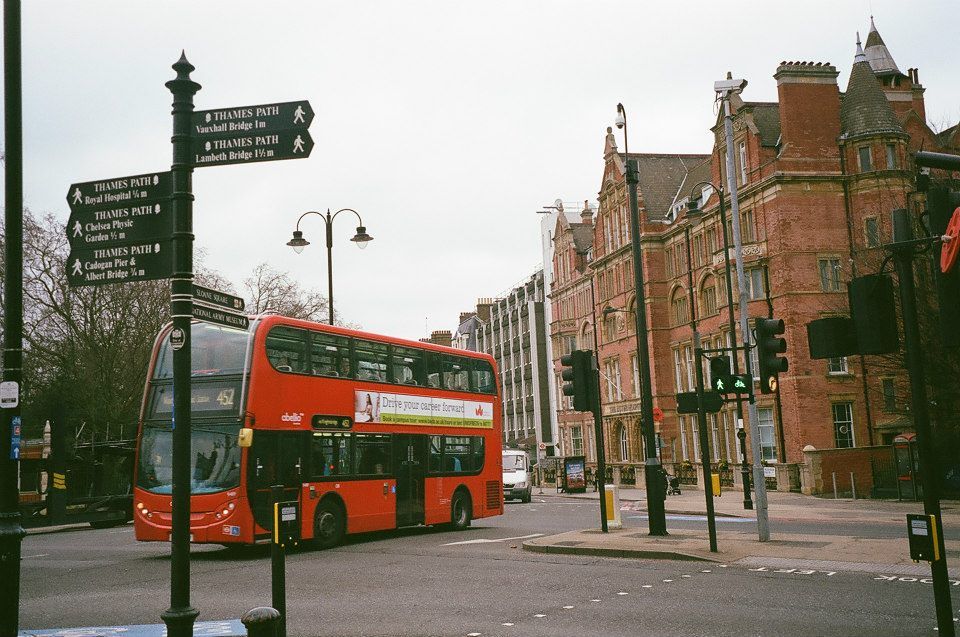

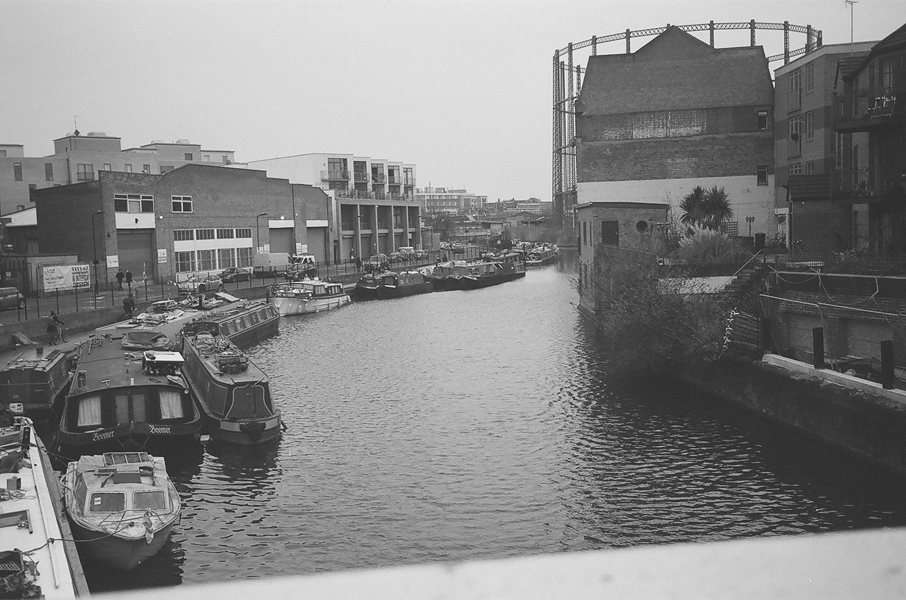

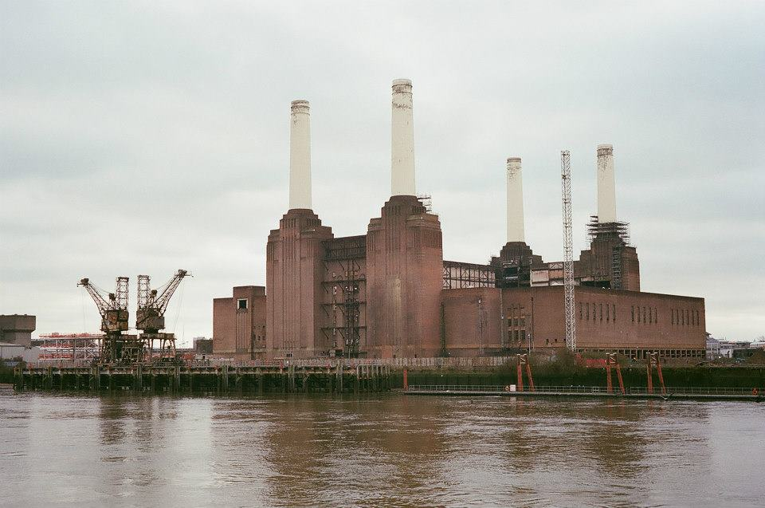

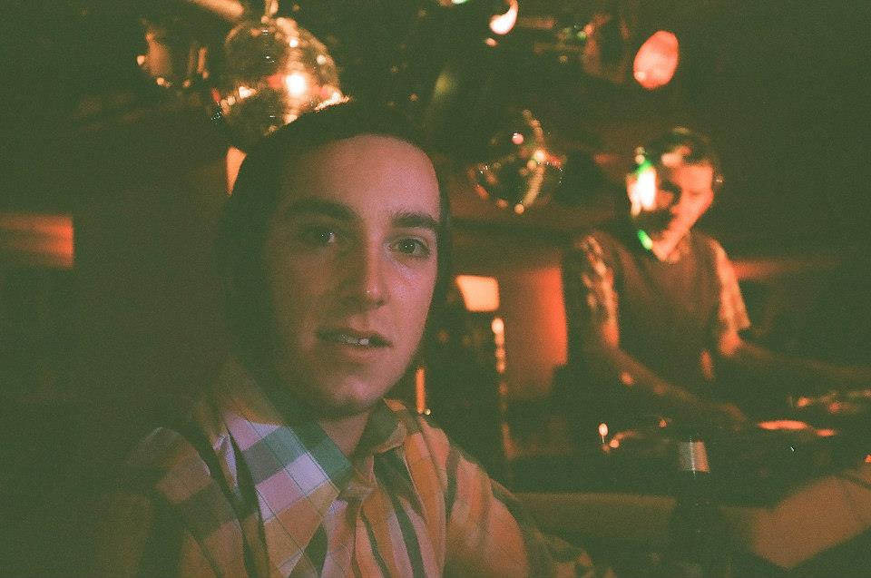

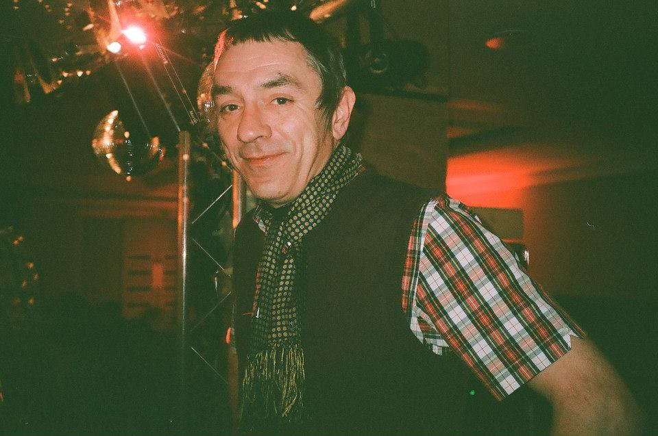

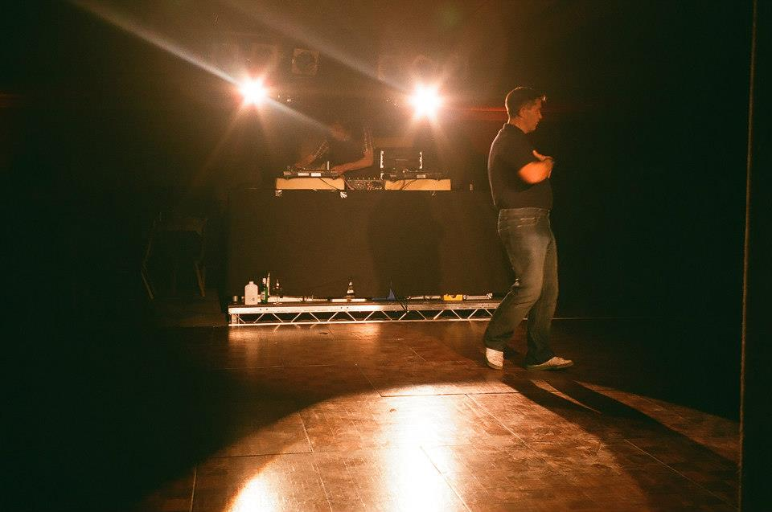

## Впечатления

Часто вспоминаю эту первую поездку на остров Великобритания. Первое знакомство с Fred Perry, электростанция Баттерси, лобстер с пивом IPA, английские акценты севера, юга и Ирландии, современный Тейт, викторианская архитектура, модернизм Барбикана и стеклянный Сити

Северный соул, ночной клуб «Дельфин» в Далстоне, субботний маркет в Хакни, сырой, но уютный Манчестер и культовый магазин Oi Polloi – всё это осталось мозаикой воспоминаний и фотографий, прошедших несколько циклов перекодирования

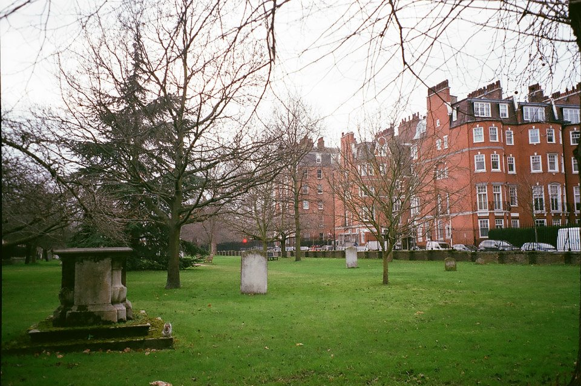

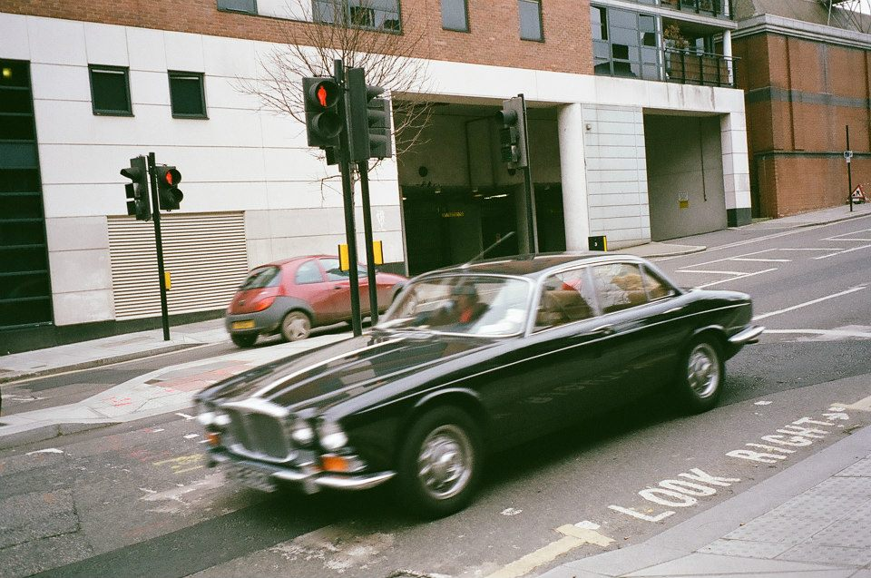

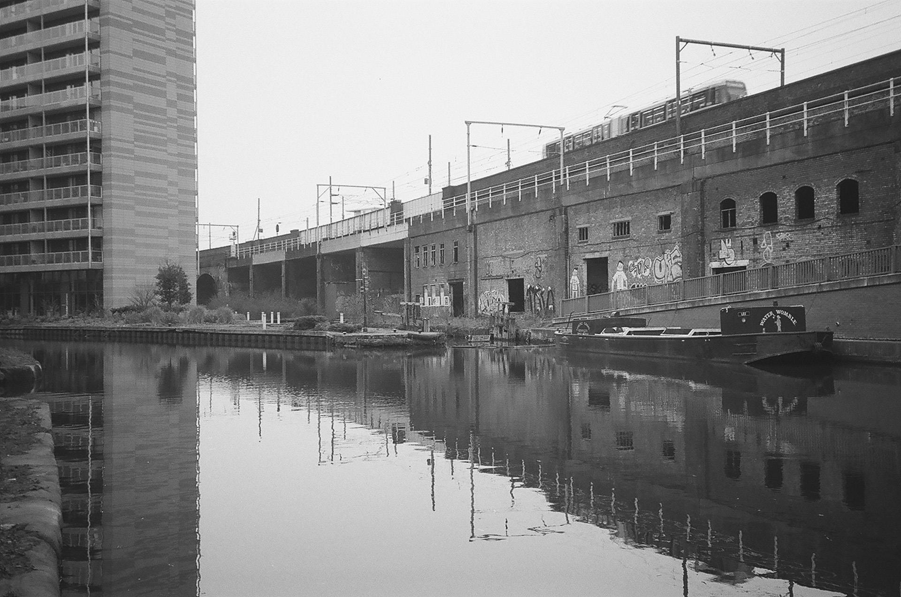

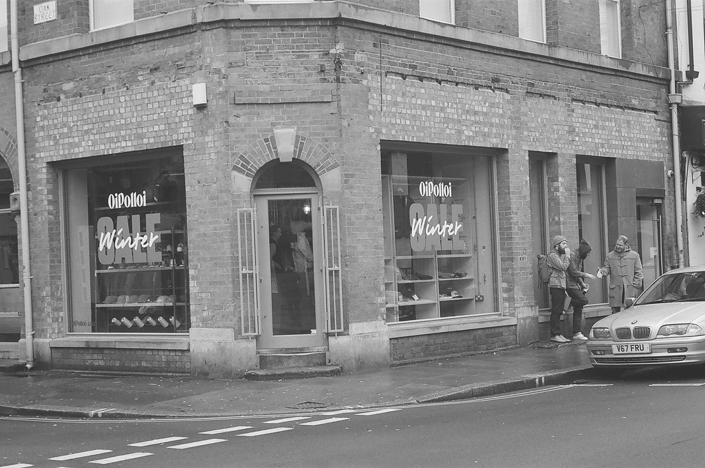

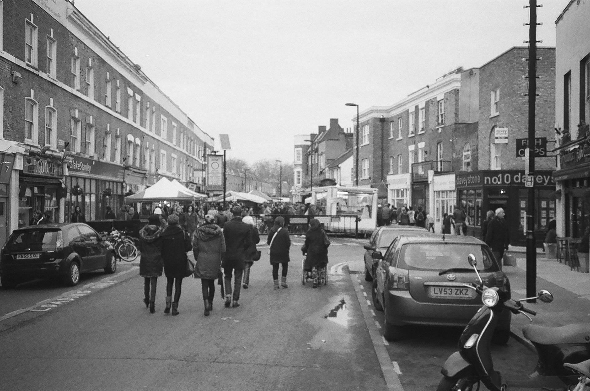
