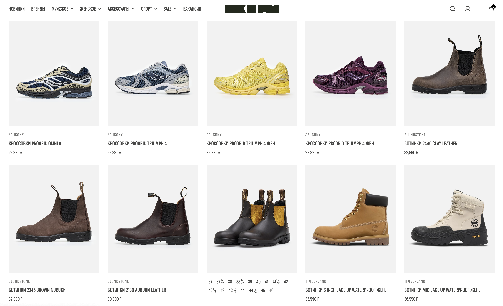
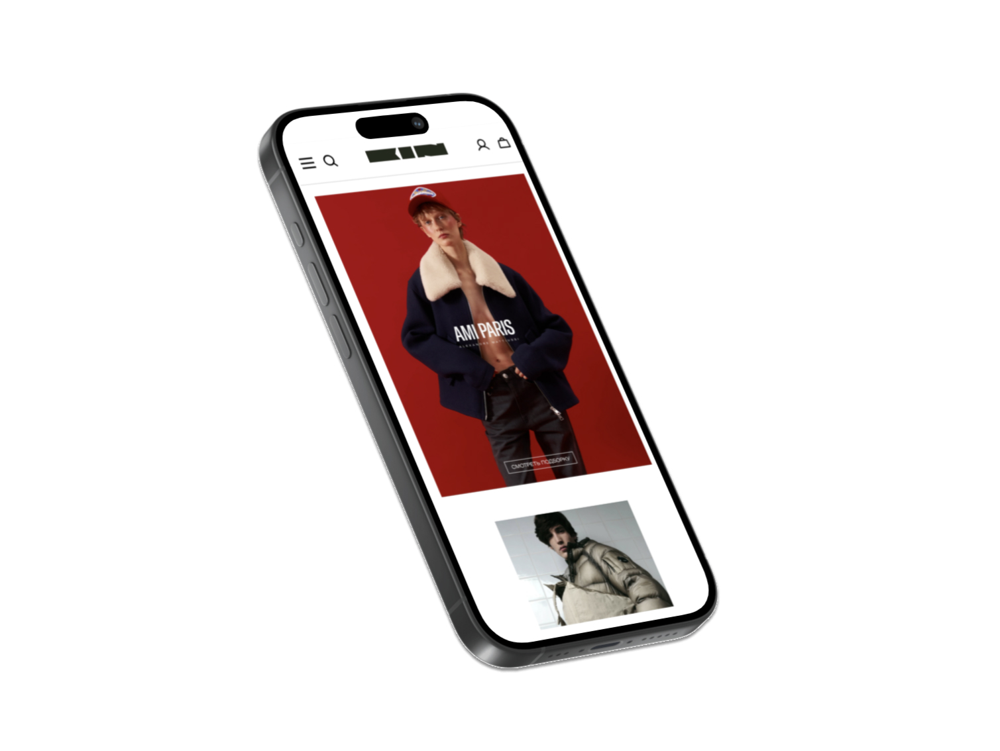

Для KIN мы с нуля собрали e-commerce платформу на Shopify

Совместно с арт-директором Анатолием Гращенко разработали базовые элементы айдентики и перенесли их в интерфейс магазина

## Магазин

Мы подключили российские сервисы оплаты и доставки, интегрировали 1С и подготовили каталог к регулярной работе команды

## Развитие

За год магазин получил программу лояльности, личный кабинет и поисковую оптимизацию

Данные со всех каналов продаж собираются в Яндекс Метрике для аналитики и управления рекламными кампаниями

