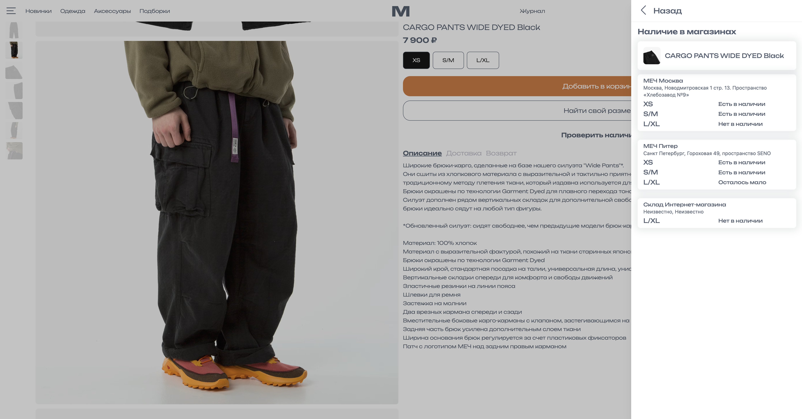
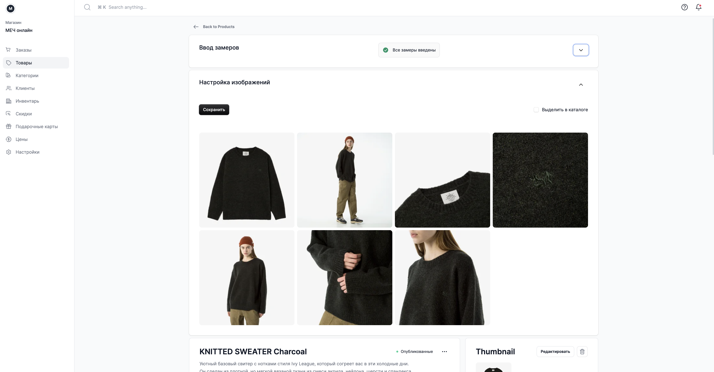
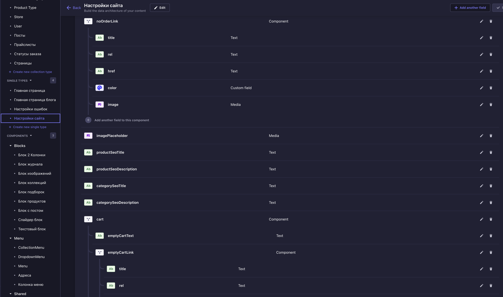

Для команды «Меч» мы разработали интернет-магазин и связали его с товарным учётом, розничными точками и системой управления контентом

## Задача

Собрать магазин, в котором данные о товарах, остатках и заказах не приходится поддерживать вручную в нескольких системах

На сайте должны отображаться актуальные остатки физических магазинов, а команда должна управлять каталогом и материалами из привычных инструментов

## Система

Основой магазина стал Medusa JS. Через него работает серверная часть магазина, заказы, промокоды и подарочные карты

Товарный учёт связан с «МойСклад», контент управляется через Strapi. Для изображений и файлов мы развернули отдельный медиасервер

## Каталог и остатки

На сайте отображается наличие товаров в розничных магазинах. Покупатель может проверить остаток до поездки, а команда работает с единым товарным учётом

Для каталога настроены сортировка и управление порядком товаров

## Покупательские сценарии

Мы добавили авторизацию, подарочные карты и промокоды

Письма отправляются через Unisender, сообщения – через Sigma SMS

## Результат

Сайт, складской учёт, розничные магазины и контент работают как одна система

Команда управляет каталогом без дублирования данных, покупатель видит актуальные остатки и получает уведомления о заказе
