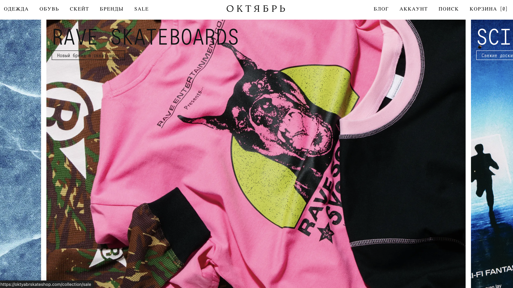
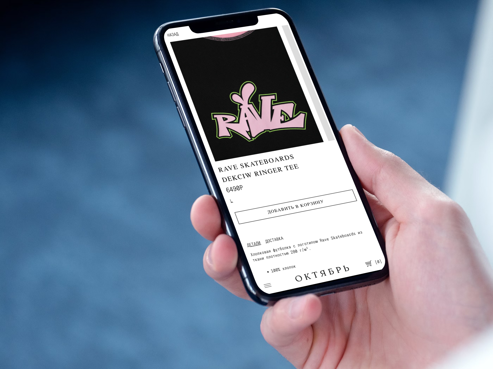

Для одного из самых узнаваемых российских скейтшопов мы разработали интернет-магазин на Shopify

Команда перенесла макеты в интерфейс, добавила журнал и подключила локальные службы оплаты и доставки

## Раффлы

Интеграция с Mindbox автоматизировала коммуникации и стала основой механики раффлов на право выкупа лимитированных кроссовок

За два месяца база клиентов выросла с 4 000 до 20 000 человек без рекламного бюджета

## Переезд

Позже мы перенесли магазин с Shopify на InSales за две недели, сохранив кастомные функции и визуальную систему проекта

